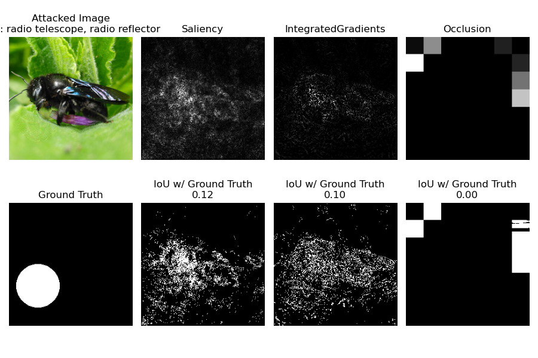
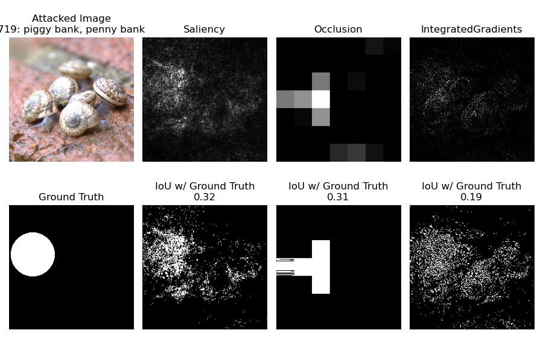
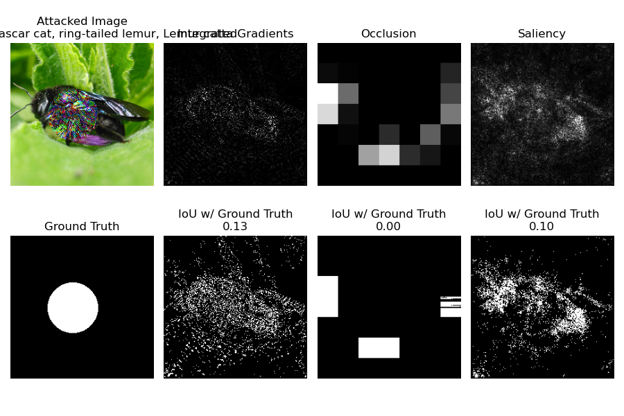
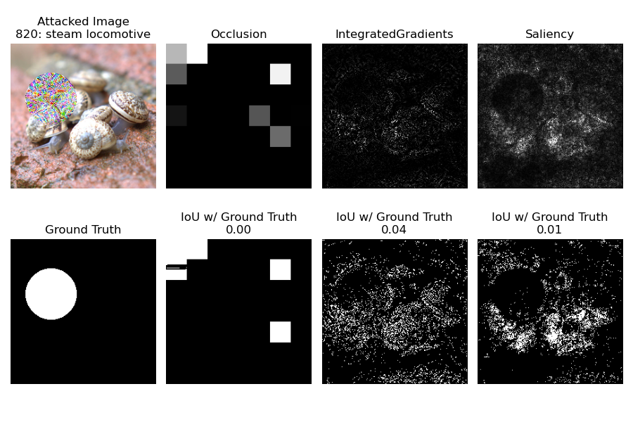

# GoldX: Ground-Truth Explanations for Visual Classifiers
Most popular explanations for visual classifiers come in the form of heatmaps.
[Captum](https://captum.ai) provides implementations of several methods to produce such explanations.

The usefulness/validity of such explanations has been called into question frequently [[Adebayo et al. 2020](https://arxiv.org/abs/2011.05429)].

I am not going to solve the problem of explanations that are difficult to understand and need explanations themselves.
I will not propose a method to produce _the best explanations_.
Instead, here I reimplement a way to generate ground-truth explanations.
These can then be used to at least evaluate explanations **quantitatively**.

Note that I did so before for a publication, with limited scope [[Göpfert et al. 2019](https://arxiv.org/abs/1910.09239)].

Eventually, I would like to provide a tool to evaluate further explanation methods, but for now I am going to focus my limited programming skills on a broad evaluation.

## Early Results
### Small Perturbations

### Large Perturbations

