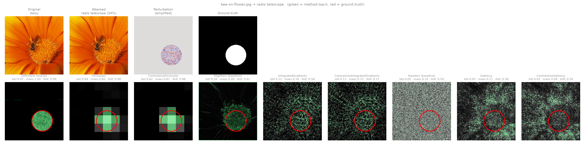
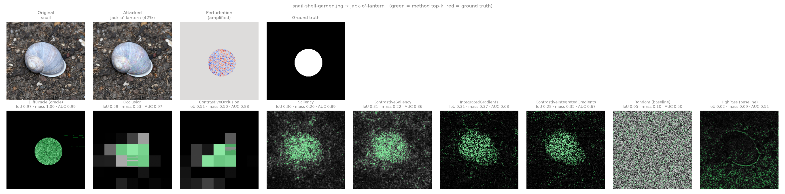

# GoldX: Ground-Truth Explanations for Visual Classifiers
Most popular explanations for visual classifiers come in the form of heatmaps.
[Captum](https://captum.ai) provides implementations of several methods to produce such explanations.

The usefulness/validity of such explanations has been called into question frequently [[Adebayo et al. 2020](https://arxiv.org/abs/2011.05429)].

I am not going to solve the problem of explanations that are difficult to understand and need explanations themselves.
I will not propose a method to produce _the best explanations_.
Instead, here I reimplement a way to generate ground-truth explanations.
These can then be used to at least evaluate explanations **quantitatively**.

Note that I did so before for a publication, with limited scope [[Göpfert et al. 2019](https://arxiv.org/abs/1910.09239)].

Eventually, I would like to provide a tool to evaluate further explanation methods, but for now I am going to focus my limited programming skills on a broad evaluation.

## How It Works

1. **Attack** — pick an image, pick a random target class, and run a targeted
   L∞ BIM attack whose perturbation is confined to a random elliptical mask.
   The mask *is* the ground-truth explanation: only pixels inside it changed,
   so only they can explain the new prediction.
2. **Explain** — run Captum methods (Saliency, Integrated Gradients, Occlusion)
   on the attacked image for the target class.
3. **Score** — binarize each heatmap (top-k pixels, k = mask size) and compute
   its IoU with the ground-truth mask.

## Usage

Requires [uv](https://docs.astral.sh/uv/).

```console
$ uv sync
$ mkdir -p data/source   # drop .png/.jpg images here
$ uv run goldx run --model resnet18 --attacks-per-image 2
$ uv run goldx report data/gold                      # re-render figures
$ uv run goldx compare r18=data/gold-r18 vit=data/gold-vit --output data
```

`goldx run` writes everything into the gold directory (default `data/gold`):
per-case artifacts and figures, `results.parquet`, `RESULTS.md`, `summary.svg`.
Models: `resnet18`, `resnet50`, `vgg16`, `vit_b_16`.

Each Captum method is evaluated in two regimes: **standard** (attribute the
target logit) and **contrastive** (attribute the *target − original* logit
difference — the "why t rather than y" question that the ground truth
actually answers).

Development:

```console
$ uv run pre-commit install
$ uv run pytest
```

## Results

Three calibration references accompany every run: **Random** (chance floor,
IoU ≈ 0.05 at 10% mask area), **HighPass** (a model-blind Laplacian filter —
any method that doesn't beat it is only detecting perturbation noise, not
explaining the model), and **DiffOracle** (pixel difference to the clean
image — privileged information, the ceiling).

ResNet-18, 9 images × 2 attacks ([full table](examples/RESULTS.md)):


Across three models ([table](examples/COMPARISON.md)):


Observations so far:

- **Occlusion dominates everywhere** (~0.5 IoU on all three models);
  gradient methods sit at 0.13–0.20. Consistent with LIME winning in
  [Göpfert et al. 2019] — perturbation-based methods localize the
  intervention far better than gradients.
- **The noise-detector confound is real but model-dependent.** On the
  ResNets, HighPass (≈ 0.09) eats most of the gradient methods' margin.
  On the ViT it collapses to chance (0.06) while gradient methods hold —
  their signal there is genuinely model-derived.
- **The contrastive regime (teal) roughly matches the standard one** —
  asking "why t rather than y" instead of "why t" doesn't rescue
  gradient methods' localization.
- **Attack success is a selection effect to watch:** at ε = 0.05 in a
  10 %-area mask, 15/18 attacks succeed on ResNet-18 and 17/18 on
  ViT-B/16, but only 6/18 on ResNet-50 (V2 weights) — better-trained
  models leave fewer, easier-to-find cases in the benchmark.

Per-case view — green is the method's top-k selection, red the ground truth:




Each run writes `results.parquet`, `RESULTS.md`, `summary.svg`, and one such plot
per case into the gold directory.

[Göpfert et al. 2019]: https://arxiv.org/abs/1910.09239
