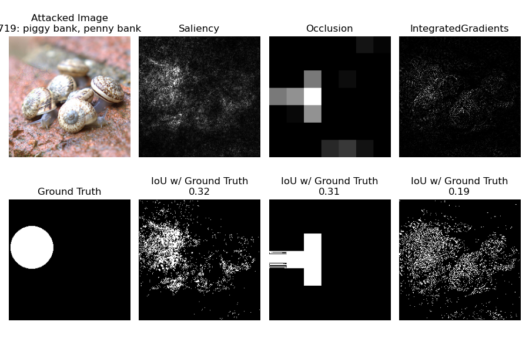
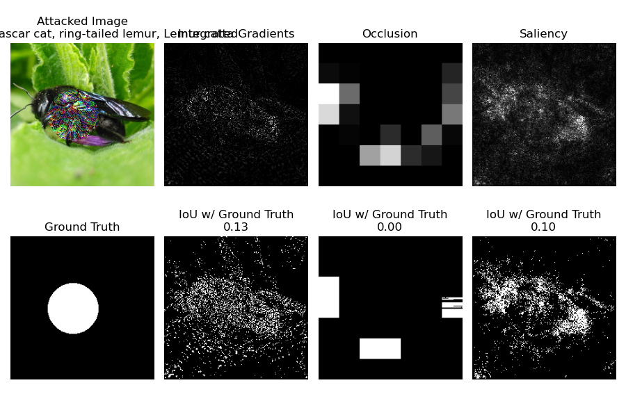
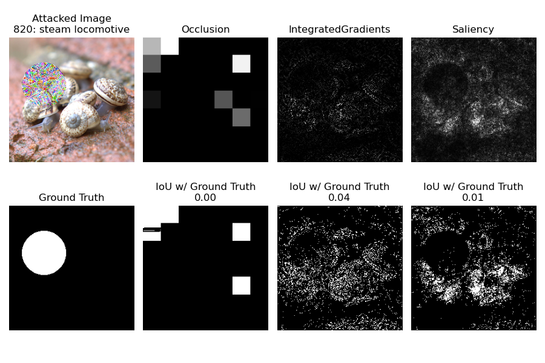

# GoldX: Ground-Truth Explanations for Visual Classifiers
Most popular explanations for visual classifiers come in the form of heatmaps.
[Captum](https://captum.ai) provides implementations of several methods to produce such explanations.

The usefulness/validity of such explanations has been called into question frequently [[Adebayo et al. 2020](https://arxiv.org/abs/2011.05429)].

I am not going to solve the problem of explanations that are difficult to understand and need explanations themselves.
I will not propose a method to produce _the best explanations_.
Instead, here I reimplement a way to generate ground-truth explanations.
These can then be used to at least evaluate explanations **quantitatively**.

Note that I did so before for a publication, with limited scope [[Göpfert et al. 2019](https://arxiv.org/abs/1910.09239)].

Eventually, I would like to provide a tool to evaluate further explanation methods, but for now I am going to focus my limited programming skills on a broad evaluation.

## How It Works

1. **Attack** — pick an image, pick a random target class, and run a targeted
   L∞ BIM attack whose perturbation is confined to a random elliptical mask.
   The mask *is* the ground-truth explanation: only pixels inside it changed,
   so only they can explain the new prediction.
2. **Explain** — run Captum methods (Saliency, Integrated Gradients, Occlusion)
   on the attacked image for the target class.
3. **Score** — binarize each heatmap (top-k pixels, k = mask size) and compute
   its IoU with the ground-truth mask.

## Usage

Requires [uv](https://docs.astral.sh/uv/).

```console
$ uv sync
$ mkdir -p data/source   # drop .png/.jpg images here
$ uv run python main.py  # results land in data/gold/
```

Development:

```console
$ uv run pre-commit install
$ uv run pytest
```

## Early Results
### Small Perturbations


### Large Perturbations


