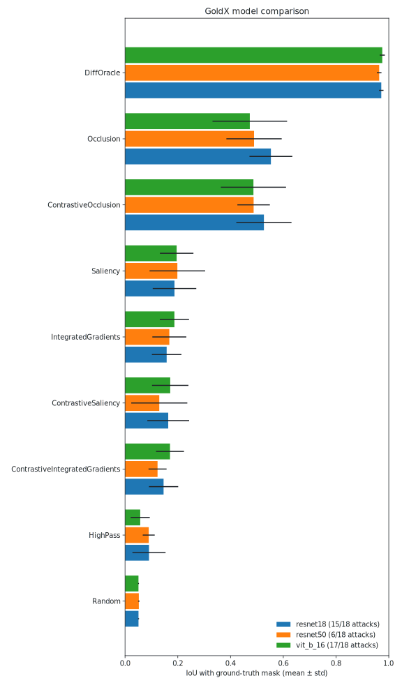

# GoldX Model Comparison

| Method | Kind | resnet18 | resnet50 | vit_b_16 |
|---|---|---|---|---|
| DiffOracle | oracle | 0.972 ± 0.009 (n=15) | 0.964 ± 0.009 (n=6) | 0.975 ± 0.010 (n=17) |
| Occlusion | method | 0.553 ± 0.081 (n=15) | 0.489 ± 0.105 (n=6) | 0.473 ± 0.141 (n=17) |
| ContrastiveOcclusion | contrastive | 0.527 ± 0.105 (n=15) | 0.488 ± 0.062 (n=6) | 0.487 ± 0.124 (n=17) |
| Saliency | method | 0.187 ± 0.083 (n=15) | 0.198 ± 0.105 (n=6) | 0.196 ± 0.064 (n=17) |
| IntegratedGradients | method | 0.158 ± 0.056 (n=15) | 0.168 ± 0.064 (n=6) | 0.187 ± 0.055 (n=17) |
| ContrastiveSaliency | contrastive | 0.164 ± 0.079 (n=15) | 0.130 ± 0.106 (n=6) | 0.171 ± 0.069 (n=17) |
| ContrastiveIntegratedGradients | contrastive | 0.146 ± 0.055 (n=15) | 0.123 ± 0.034 (n=6) | 0.170 ± 0.053 (n=17) |
| HighPass | baseline | 0.091 ± 0.063 (n=15) | 0.090 ± 0.023 (n=6) | 0.058 ± 0.036 (n=17) |
| Random | baseline | 0.051 ± 0.002 (n=15) | 0.052 ± 0.003 (n=6) | 0.051 ± 0.002 (n=17) |

