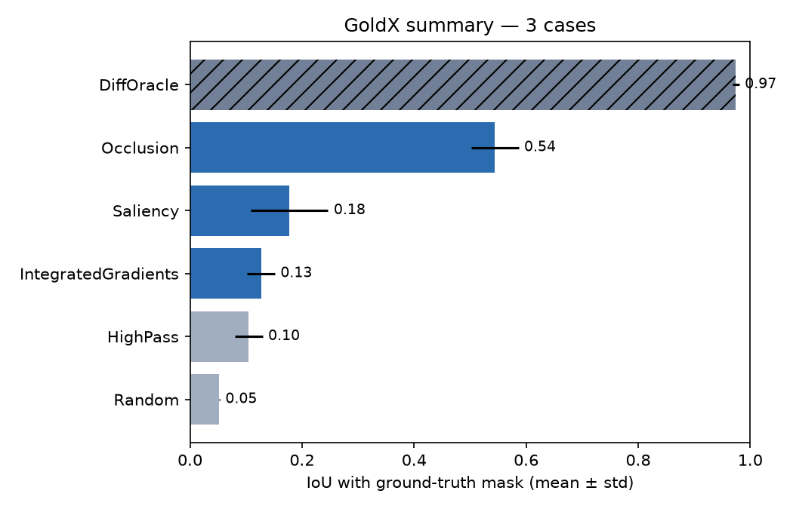

# GoldX Results

| Method | Kind | n | IoU | Relevance mass | Pixel AUC |
|---|---|---|---|---|---|
| DiffOracle | oracle | 3 | 0.974 ± 0.006 | 1.000 | 0.993 |
| Occlusion | method | 3 | 0.544 ± 0.042 | 0.514 | 0.956 |
| Saliency | method | 3 | 0.177 ± 0.069 | 0.181 | 0.775 |
| IntegratedGradients | method | 3 | 0.127 ± 0.025 | 0.173 | 0.596 |
| HighPass | baseline | 3 | 0.105 ± 0.025 | 0.156 | 0.757 |
| Random | baseline | 3 | 0.052 ± 0.001 | 0.098 | 0.504 |

Kinds: *method* sees only model + attacked image. *baseline* is model-blind. *oracle* reads the clean reference image (upper bound).

