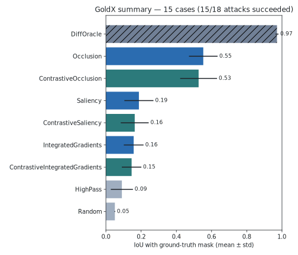

# GoldX Results

**Attack success:** 15/18 (9 source images, 2 attacks each).

| Method | Kind | n | IoU | Relevance mass | Pixel AUC |
|---|---|---|---|---|---|
| DiffOracle | oracle | 15 | 0.972 ± 0.009 | 1.000 | 0.993 |
| Occlusion | method | 15 | 0.553 ± 0.081 | 0.500 | 0.969 |
| ContrastiveOcclusion | contrastive | 15 | 0.527 ± 0.105 | 0.526 | 0.962 |
| Saliency | method | 15 | 0.187 ± 0.083 | 0.183 | 0.762 |
| ContrastiveSaliency | contrastive | 15 | 0.164 ± 0.079 | 0.166 | 0.724 |
| IntegratedGradients | method | 15 | 0.158 ± 0.056 | 0.206 | 0.614 |
| ContrastiveIntegratedGradients | contrastive | 15 | 0.146 ± 0.055 | 0.193 | 0.598 |
| HighPass | baseline | 15 | 0.091 ± 0.063 | 0.140 | 0.689 |
| Random | baseline | 15 | 0.051 ± 0.002 | 0.097 | 0.500 |

Kinds: *method* sees only model + attacked image. *baseline* is model-blind. *oracle* reads the clean reference image (upper bound).

